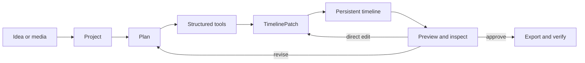
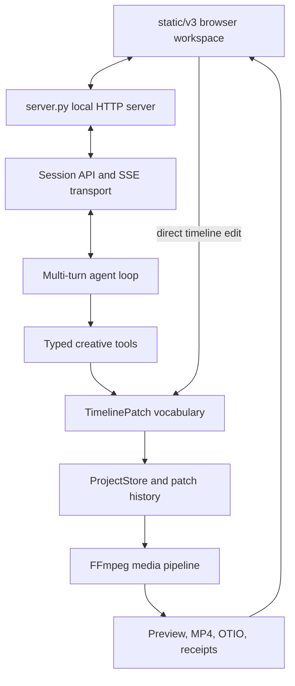

<p align="center">
  <a href="https://lumeri.io/">
    
  </a>
</p>

<h1 align="center">Lumeri</h1>

<p align="center">
  <strong>A creative workspace where language becomes an editable project.</strong>
</p>

<p align="center">
  Plan with an AI, watch it work on a real timeline, change any decision, and export the result.
</p>

<p align="center">
  <a href="https://lumeri.io/">Website</a>
  ·
  <a href="https://docs.lumeri.io/">Documentation</a>
  ·
  <a href="#quick-start">Quick start</a>
  ·
  <a href="#architecture">Architecture</a>
  ·
  <a href="CONTRIBUTING.md">Contributing</a>
</p>

<p align="center">
  <a href="https://github.com/Acrabxie/lumeri/actions/workflows/test.yml">
    
  </a>
  <a href="https://github.com/Acrabxie/lumeri/actions/workflows/codeql.yml">
    
  </a>
  
  <a href="LICENSE">
    
  </a>
</p>

## Creation should leave a project behind

Most AI media tools end with an answer or a generated file. Lumeri keeps the
work itself.

An idea becomes a persistent Project. The model works through explicit media
operations. Every timeline edit is represented as structured data, so the same
result can be inspected, corrected, replayed, rendered again, or continued in a
later session. The chat, canvas, preview, files, and timeline are different
views of one creative state—not disconnected tools.

This repository contains the open, single-user local engine behind **Lumeri
Video**, the first workspace in the Lumeri family.

## Why Lumeri

| | Lumeri's approach |
|---|---|
| **Project-native** | Conversations belong to durable Projects with media, history, and a real multi-track timeline. |
| **Editable by construction** | The AI and the creator use the same validated patch vocabulary instead of maintaining two competing edit states. |
| **Observable** | Plans, tool calls, progress, failures, previews, and completion are streamed as explicit session events. |
| **Local-first** | The public runtime, workspace, media processing, and project state run on your computer. |
| **Provider-flexible** | Use a local ChatGPT/Codex sign-in or connect Vertex AI, Gemini, OpenAI, Anthropic, OpenRouter, or an OpenAI-compatible endpoint. |
| **Made for iteration** | Import, inspect, assemble, preview, revise, verify, and export without throwing away the creative history. |

## What you can make

Lumeri combines planning, generation, editing, and delivery in one workspace:

- build shot lists and turn them into structured timelines;
- import, probe, search, annotate, and organize local media;
- trim, arrange, layer, composite, reframe, grade, and transition clips;
- create captions, kinetic type, vector motion, graphics, narration, and audio mixes;
- generate image, video, and audio assets through configured providers;
- preview timeline state and directly edit clips with undoable operations;
- export H.264/AAC MP4 masters and exchange timelines through OpenTimelineIO;
- verify delivery output and retain machine-readable render evidence.

The engine exposes a broad capability surface, but it does not ask the model to
improvise editor macros. Operations are typed, validated, and applied to the
Project that the creator can see.

## The creative loop



The Project is the source of truth throughout the loop. AI changes and direct
timeline edits converge on the same state before preview or export.

## Quick start

### Requirements

- Python 3.12 or newer
- Git
- a complete FFmpeg installation with both `ffmpeg` and `ffprobe` on `PATH`
- one supported model connection for AI-assisted work

On macOS, FFmpeg is available through Homebrew:

```bash
brew install ffmpeg
```

On Ubuntu or Debian:

```bash
sudo apt-get update
sudo apt-get install ffmpeg
```

### macOS and Linux

```bash
git clone https://github.com/Acrabxie/lumeri.git
cd lumeri

python3 -m venv .venv
source .venv/bin/activate
python -m pip install --upgrade pip
python -m pip install -e .

python -m gemia serve
```

Open [http://127.0.0.1:7788/](http://127.0.0.1:7788/) when the server is ready.

### Windows 10 and 11

Install 64-bit Python 3.12+, Git, and a complete FFmpeg package, then run the
repository's PowerShell setup from the cloned directory:

```powershell
git clone https://github.com/Acrabxie/lumeri.git
cd lumeri

.\scripts\windows\setup.ps1
.\scripts\windows\start.ps1
```

The setup script creates `.venv`, installs Lumeri, and runs a non-destructive
prerequisite check. The start script serves the source workspace at
`http://127.0.0.1:7788/`; it does not install a Windows application or EXE.

If PowerShell blocks reviewed local scripts, change policy for the current
process only:

```powershell
Set-ExecutionPolicy -Scope Process -ExecutionPolicy Bypass
```

### Connect a model

After the workspace opens, type `/setup` in the composer. Choose a provider,
enter the required local credentials, test the connection, and save it. New
sessions use the selected provider without a server restart.

| Connection | What it uses |
|---|---|
| **ChatGPT subscription** | A local Codex CLI session created with `codex login`; Lumeri does not read or store the login credential. |
| **Google Vertex AI** | GCP Application Default Credentials, project, location, and model. |
| **Google Gemini API** | A Gemini API key and model. |
| **OpenAI** | An OpenAI API key and model. |
| **Anthropic Claude** | An Anthropic API key and model. |
| **OpenRouter** | An OpenRouter API key and routed model. |
| **Custom** | An OpenAI-compatible base URL, key, and model. |

Provider configuration is stored locally in `~/.gemia/config.json`. Keep that
file out of source control and never paste credentials into issues, logs, or
test fixtures.

### Use another port

```bash
python -m gemia serve --port 7790
```

```powershell
.\scripts\windows\start.ps1 -Port 7790
```

You can confirm a running server without creating a Project or calling a model:

```bash
curl http://127.0.0.1:7788/health
```

## Architecture



### Repository map

| Path | Responsibility |
|---|---|
| `server.py` | Loopback-first HTTP entry point, static workspace, configuration, files, Projects, and route delegation. |
| `static/v3/` | Build-free browser workspace with chat, preview, Project navigation, and direct timeline editing. |
| `gemia/agent_loop_v3.py` | Multi-turn model and tool orchestration. |
| `gemia/v3_routes.py` | Session lifecycle, turns, assets, transcripts, timeline access, and SSE streaming. |
| `gemia/tools/` | Typed creative operations for media analysis, generation, editing, composition, audio, and delivery. |
| `gemia/project_*` | Canonical Project schema, storage, inspection, preview rendering, and export. |
| `lumerai/patches.py` | Shared, validated `TimelinePatch` edit language. |
| `lumerai/otio_adapter.py` | OpenTimelineIO interchange. |
| `lumenframe/` | Layer-based composition and motion-graphics core. |
| `tests/` | Protocol, project, timeline, render, security, session, and platform regressions. |

The public name is **Lumeri**. The `gemia` Python package and `~/.gemia`
application-data directory retain the project's historical name for
compatibility.

### Session protocol

The browser uses an HTTP and Server-Sent Events protocol rather than hidden UI
automation. The central surface includes:

| Endpoint | Purpose |
|---|---|
| `POST /sessions` | Create a session. |
| `POST /sessions/{id}/turn` | Submit a creator message. |
| `GET /sessions/{id}/stream` | Receive ordered progress and result events. |
| `GET /sessions/{id}/timeline` | Read current timeline state. |
| `POST /sessions/{id}/timeline/op` | Apply a direct creator edit. |
| `GET /sessions/{id}/transcript` | Read the durable NDJSON transcript. |

See [`gemia/v3_contract.py`](gemia/v3_contract.py) for the versioned event and
error vocabulary.

## Engine contracts

These constraints keep Lumeri's AI and editor from drifting apart:

1. Every timeline mutation—whether initiated by the model or the creator—goes
   through the shared patch vocabulary.
2. The v3 tool protocol is the agent path; parallel hidden agent loops are not
   introduced beside it.
3. Project state is persisted independently of presentation state and retains
   ordered patch history.
4. FFmpeg work is routed through the shared media execution layer so commands,
   errors, and output checks remain consistent.
5. Completion is an observable protocol state, not an assumption inferred from
   a model response.

## Local data and safety boundary

The public repository is a local creative runtime, not Lumeri's hosted account
or commerce stack.

- The server binds to `127.0.0.1` by default. Do not expose a development
  checkout directly to the public internet.
- Projects, session history, settings, generated media, caches, and render
  evidence remain on the current computer unless you explicitly move them or a
  configured provider receives content for a requested operation.
- Hosted authentication, email delivery, cloud account management, billing,
  and subscription services are intentionally outside this repository.
- Model-generated shell and build execution is guarded by the native sandbox
  when the host supports it. On native Windows, those operations stay locked by
  default because the macOS sandbox is unavailable; only the computer owner can
  explicitly enable unrestricted execution.
- Runtime directories and secrets are ignored by Git. Review staged files
  before every commit.

## Development

Create a development environment and install the test dependencies:

```bash
python3 -m venv .venv
source .venv/bin/activate
python -m pip install -e ".[dev]"
```

Run the same core checks used by CI:

```bash
python -m compileall -q gemia lumerai lumenframe server.py
python -m pytest tests/ -q
```

Inspect an existing Project directory from the command line:

```bash
python -m gemia inspect /path/to/project
```

Before opening a pull request, read [CONTRIBUTING.md](CONTRIBUTING.md), keep the
change focused, add regression coverage for behavior changes, and confirm that
no credentials, private media, personal paths, or generated artifacts are
included.

## Project status

Lumeri is under active development. Internal APIs, creative verbs, and Project
formats may evolve as the editing model is refined. The current `main` branch is
the supported public source line; use issues and pull requests for proposals,
and avoid treating a preview checkout as an internet-facing service.

## Community and security

- Read the [Code of Conduct](CODE_OF_CONDUCT.md).
- Meet the people in [CONTRIBUTORS.md](CONTRIBUTORS.md).
- Report vulnerabilities privately through [SECURITY.md](SECURITY.md), not in
  a public issue.

## License

Lumeri is available under the [MIT License](LICENSE).
